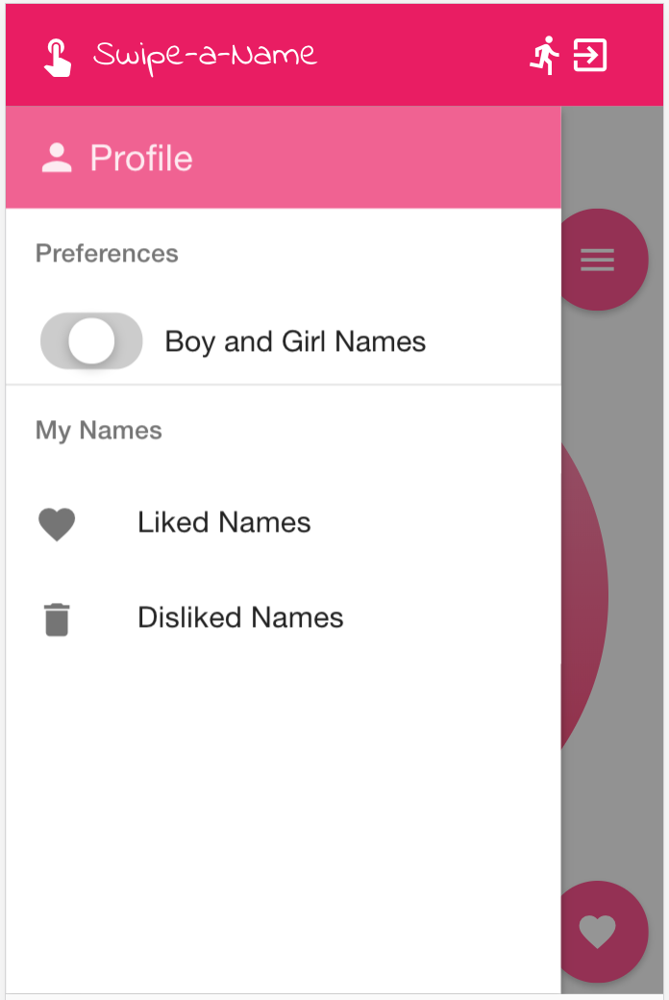

# swype-a-name

https://swipe.danedmunds.ca

Names from https://www.ssa.gov/oact/babynames/limits.html

A Tinder clone for choosing baby names! Swipe right to like a name and left to dislike a name




## Running

### Local Dev Mode

- Start mongo
  ```
  > cd mongo
  > docker-compose up -d
  > ./mongo-restore-names.sh
  ```
- run server in dev mode so it also serves the client resources
  ```
  > cd server
  > DEV=1 node server 
  DEV MODE
  Listening on 3000
  ```
- visit http://localhost:3000

### Running HTTPS

- For testing HTTPS on localhost, generate localhost certs
  ```
  > cd certs
  > ./generate-localhost-cert.sh
  Generating a 2048 bit RSA private key
  ..........................................+++
  ..........+++
  writing new private key to 'localhost.key'
  -----
  You are about to be asked to enter information that will be incorporated
  into your certificate request.
  What you are about to enter is what is called a Distinguished Name or a DN.
  There are quite a few fields but you can leave some blank
  For some fields there will be a default value,
  If you enter '.', the field will be left blank.
  -----
  Country Name (2 letter code) []:
  State or Province Name (full name) []:
  Locality Name (eg, city) []:
  Organization Name (eg, company) []:
  Organizational Unit Name (eg, section) []:
  Common Name (eg, fully qualified host name) []:localhost
  Email Address []:
  ```
- Run with HTTPS
  ```
  > cd server
  > DEV=1 HTTPS=1 node server
  DEV MODE
  Listening on 3000
  Listening on 3443
  ```
- visit https://localhost:3443